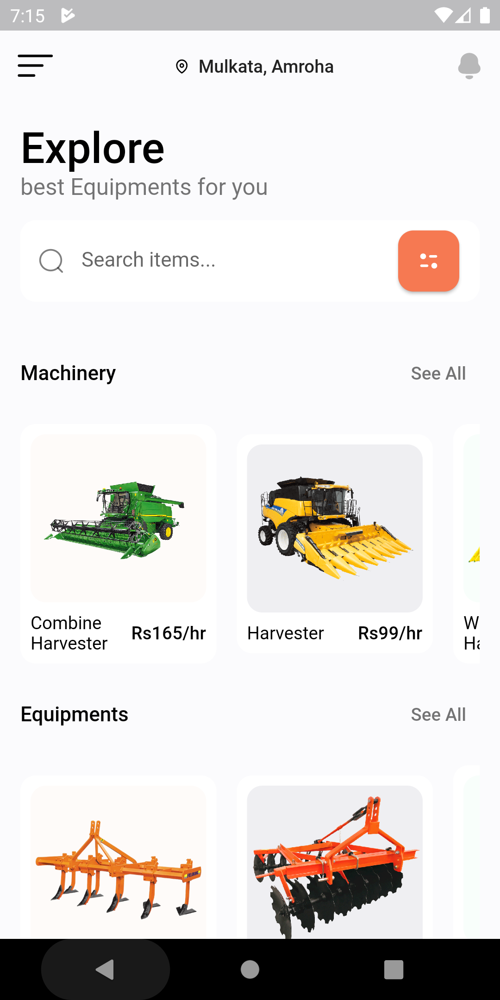
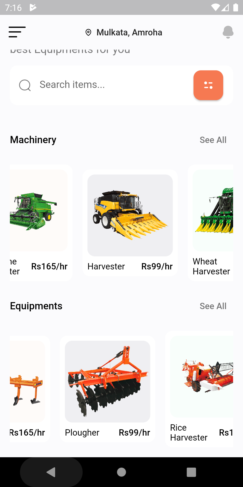
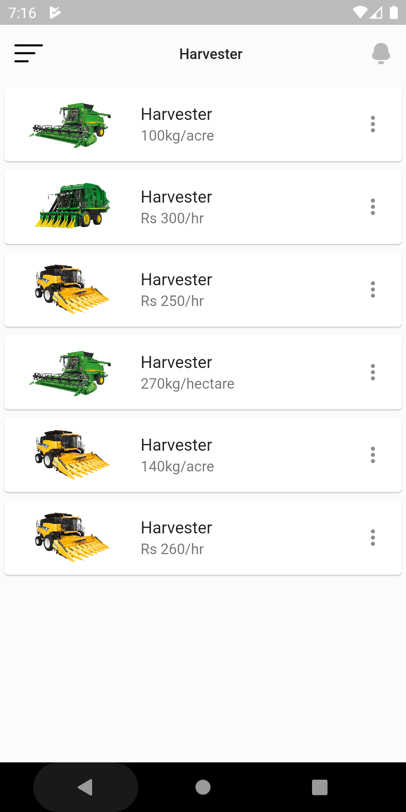

# KrishiMitra

An android app made in flutter for farmers to trade or rent out farm equipment's or machinery.

## Introduction

An app for farmers to trade or rent out farm equipment's or machinery. Provides a platform to connect the farm owners and labours. The seller can post the all the information about the product and the buyer can contact the seller according to his/her prefrences. This system will work according to user's location and will show  result within a particular radius like 2 km , 5km or 10km set by the user. This is done because in rural areas people prefer to hire labour or rent equipments from thier own or nearby villages only. 

The main aim of the app is to provide one platform for every agriculture or farming related need. 

## Key components

* Home screen shows different categories like machinery, equipments, labours etc as shown in first image.

* These categories when further expanded shows detailed information about that category. 

* When we click on further then a list of all the available options appears as shown in third image.

|         Home screen         |          Home screen          |                 Product Detail screen                 |
| :-------------------------: |  :-------------------------: | :-----------------------------------------------------: |
|  |  |  | 

* On the product detail screen the user can sort and filter the available options on basis of price, location and ratings.

* In this people can create their own profile or a different app will be there in which one person can create profile for others and add their details. this is helpful for those people who doesn't have smartphones or are illiterate. 

## Future scopes

* Weather forecast information can be added to the app which will help farmers to plan things ahead.

* Integration with google maps so that users can see others user on map.

* Internet call feature can be added to improve connectivity.

* Chatbots or group chat features can be added to help farmers resolve farming related issues via chatting with experts. 

* Regional language support can also be added to the app. 

* Online classes for farmers to keep them up to date with new technologies and best farming practices.

* Marketplace for farmers to buy good quality seeds or fertilizers from either online or offline from any nearest shop.

* Different section to educate farmers for all the government policies related to agriculture.

## Built with

* [Flutter](https://flutter.dev/) - SDK by google
* [Firebase](https://firebase.google.com/) for user authentication and data storage
* Agile methodology

## Authors

* **Vaibhav Krishan Yadav** - [LinkedIn](https://www.linkedin.com/in/vaibhavkrishanyadav/)

